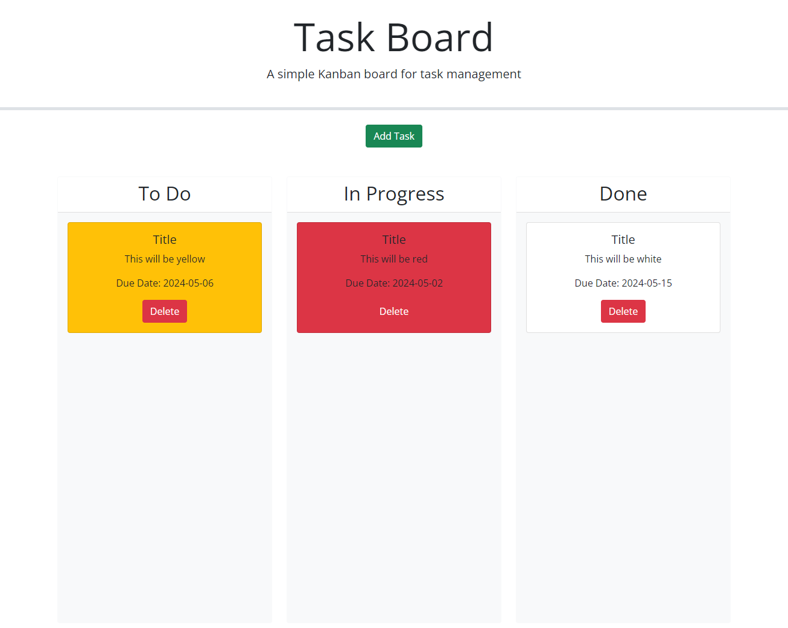

# Challenge-5-Task-Board-Jacqueline_Obeidzinski
This is Jaci Obeidzinski's Challenge for Module 5. The landing page will have 3 columns labeled to do, in-progress and done for each step for a task. When the add task button is clicked a modal will show up to ask for a title, date and description of the task. Then a task card will apear with those inputs on it in the to do colunm. The cards can then be dragged into the other columns and will stay there when the page is refreshed. 

## How it's Made:
Tech used: HTML, CSS, jQuery,  and JavaScript

## Lesson Learned
During this activity Jaci learned how use make a randomly gerated id that would be used to filter thorugh and array to find a wanted input. Jaci also learned how to use basic jQuery commands to be able to drag and drop items into other containers.

## Special Thanks
Thank you to everyone in my class for participating in class allowing me to learn more. 
Thank you to my instructor Chris and the Teaching Assistant Steven.
Thank you to Austin Lee @ kushonim for helping me with fixing code. 
## Screen Shot
